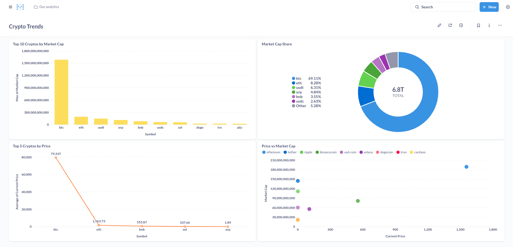

# End-to-End Cloud Data Pipeline with AWS, Airflow, Redshift, and PostgreSQL

This project showcases an end-to-end data engineering pipeline that ingests real-time cryptocurrency data from a public API, stores it in AWS S3, processes and transforms the data using AWS Glue and PySpark, and loads it into both Amazon Redshift and a local PostgreSQL database. The pipeline is orchestrated using Apache Airflow, enabling full automation from ingestion to loading. For visualization and insights, Metabase is used to build a live dashboard using the PostgreSQL database as the backend. This project is designed to be fully reproducible locally with PostgreSQL while also demonstrating how to scale using AWS services.

## About This Project

This project was built to simulate a real-world data engineering workflow—from ingestion of live API data to cloud storage, transformation, orchestration, and dashboarding. It integrates modern tools and cloud services such as AWS S3, Glue, Redshift, Apache Airflow, and Metabase to demonstrate a complete end-to-end pipeline.

Whether you're preparing for data engineering interviews, exploring the AWS ecosystem, or building production-grade pipelines, this project offers a hands-on blueprint for working with real-time data in a scalable and automated manner.


## Tools and Technologies Used

- Python
- Apache Airflow (Dockerized)
- AWS S3
- AWS Glue (PySpark)
- AWS Redshift
- PostgreSQL (local)
- Metabase
- Docker

## Architecture

1. Extract data from CoinGecko API.
2. Store raw data in AWS S3 and local PostgreSQL.
3. Transform data using AWS Glue and PySpark.
4. Load transformed data to Redshift and PostgreSQL.
5. Orchestrate the process using Apache Airflow.
6. Visualize insights using Metabase.

## Repository Structure

```
.
├── dags/
│   └── crypto_pipeline_dag.py
├── jars/
│   └── postgresql-42.7.1.jar
├── scripts/
│   ├── ingest.py
│   ├── transform.py
│   └── glue_script.py
├── metabase/
│   └── dashboard_screenshot.png
└── docker-compose.yml
└── Dockerfile
└── init_admin.sh
└── README.md
└── requirements.txt
```

## Pipeline Steps

### 1. Data Ingestion

- Extracted data from CoinGecko API.
- Stored raw data in JSON format to AWS S3.
- Mirrored raw data into PostgreSQL for reproducibility.

### 2. Transformation

- **Locally**: Data is transformed using PySpark via `transform.py` for reproducibility.
- **On AWS**: A corresponding AWS Glue script (`scripts/glue_script.py`) is included to demonstrate how the transformation can be scaled using AWS Glue (PySpark).
- **Final schema**: `id`, `symbol`, `name`, `current_price`, `market_cap`.

### 3. Data Loading

- Loaded transformed data into Amazon Redshift.
- Mirrored the same into local PostgreSQL for visualization.

### 4. Orchestration

- Apache Airflow DAG defined with the following tasks:
  - Ingest data
  - Transform data
  - Load to databases
- DAG configured to run end-to-end pipeline.

### 5. Visualization

- Metabase connected to PostgreSQL.
- Dashboard built using the table `crypto_filtered`.

## Steps to Run the Project

1. **Clone the repository**

```bash
git clone https://github.com/your-username/crypto-data-pipeline.git
cd crypto-data-pipeline
```

2. **Configure Environment Variables**

	Create a `.env` file in the root of the project with the following content:

```env
POSTGRES_USER=your_user
POSTGRES_PASSWORD=your_password
POSTGRES_DB=crypto_db
POSTGRES_PORT=5432
POSTGRES_HOST=host.docker.internal  # or 172.17.0.1 on Linux

API_URL=https://api.coingecko.com/api/v3/coins/markets
API_PARAMS=?vs_currency=usd&order=market_cap_desc&per_page=100&page=1&sparkline=false

```

3. **Start the Project with Docker**

	This will spin up all necessary services, including Airflow and PostgreSQL.

```bash
docker compose up --build airflow-init
docker-compose up -d
```

4. **Trigger the DAG**

	- Visit `http://localhost:8080`
	- Log in to Airflow with default credentials: `admin` / `admin`
	- Enable and trigger `crypto_pipeline_dag`

5. **Monitor the Pipeline**- The DAG will:

    - Ingest real-time crypto data from CoinGecko
    - Store it in local PostgreSQL and optionally in AWS S3
    - Transform and write into PostgreSQL (or Redshift if configured)
    - Enable visualization via Metabase

6. (Optional) Visualize Insights in Metabase

    - Access the Metabase UI at `http://localhost:3000`
	- Connect it to your PostgreSQL container
	- Explore dashboards and charts included with the project

## Final Dashboard

The Metabase dashboard displays the following visualizations:

1. Bar chart: Top 10 Cryptos by Market Cap
2. Scatter plot: Price vs Market Cap
3. Line chart: Top 5 Cryptos by Price
4. Pie chart: Market Cap Share

The dashboard provides a clear view of the most dominant cryptocurrencies and how they relate in terms of price and market value.



## Learning Outcomes

- Designed scalable data pipelines using AWS services.
- Hands-on experience with Apache Airflow and Glue.
- Built and visualized a real-world dashboard using Metabase.

## License

This project is open-source and available under the MIT License.